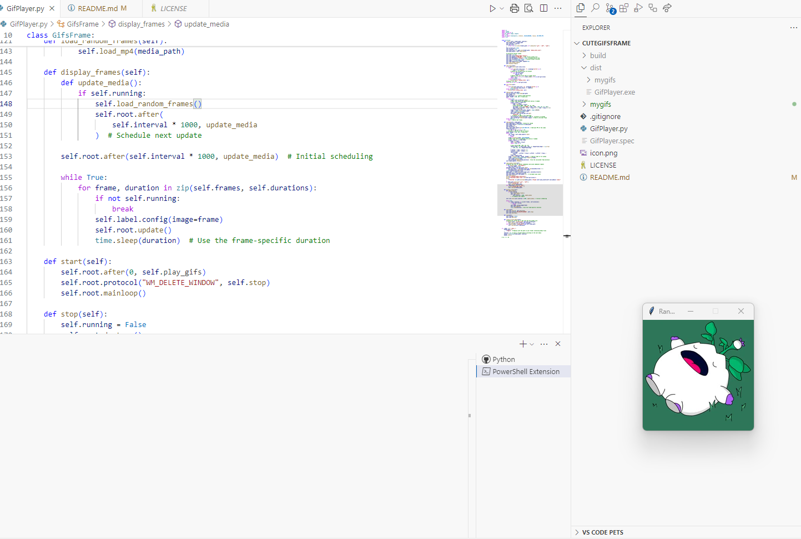

# CuteGifsFrame
A little software that shows gifs and videos in a little window. Every n seconds a new gif is loaded.

This project was made to display the gifs and videos that my beloved girlfriend sends to me, making every moment a bit more special.

## Features
- Displays gifs and videos in a small, always-on-top window
- Automatically cycles through your collection every few seconds
- Perfect for showcasing your favorite moments and memories

## How to Use
1. Add your gifs and videos to the `mygifs` folder.
2. Run the application (`GifPlayer.py`).
3. Enjoy a rotating display of your favorite media!

## Screenshot

